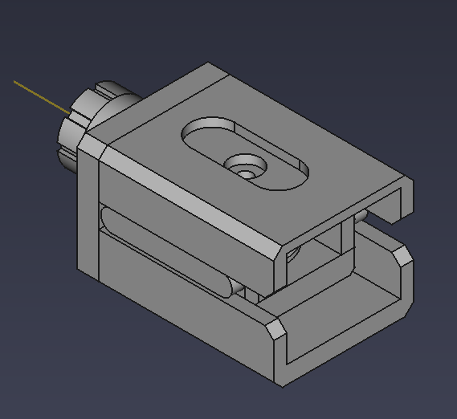
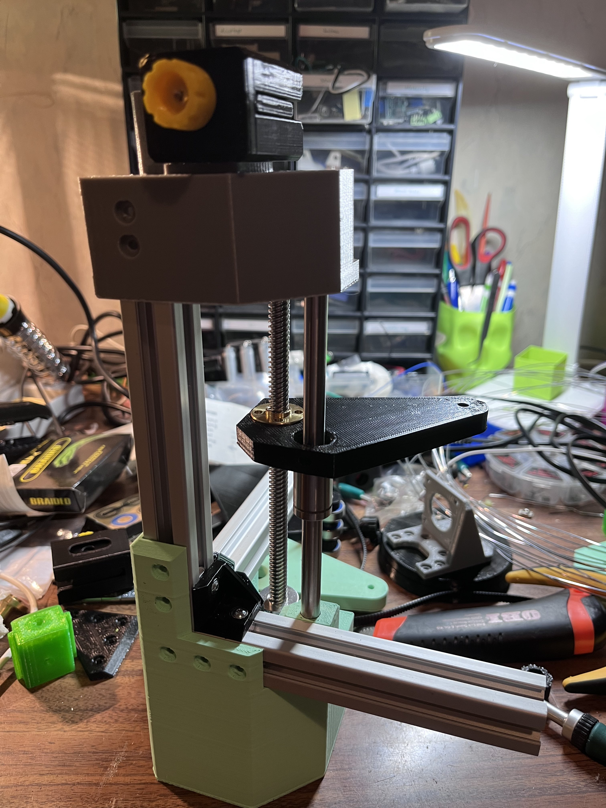

# Belt tensioner

Separate module pluggable belt tensioner. If you want to use it on your own
designs, leave space for a 32x45x30mm rectangle, and place 2xM3 holes spaced
15mm from each other.

## BOM

| Thing | How many |
| --- | --- |
| M3 heatset insert | 2 plus 2 for mounting |
| M3x50mm screw | 1 |
| M3x20mm screw | 1 |
| [this](https://www.aliexpress.com/item/32817328238.html), make sure to select the B3 version | 1 |
| M3 nut | 1 |

## Printing

Print all parts on on their backs, they don't need supports. The material
doesn't really matter.

## Assembly

0) heatset inserts in the handle (insert from the front) and the non-countersunk hole in the slide
1) long screw in slide, tighten it in place with nut
2) belt in slide
3) idler in slide, screw it down
4) housing screwed down to whatever piece you want it on
5) slide inserted into housing
6) handle fixed to slide screw

